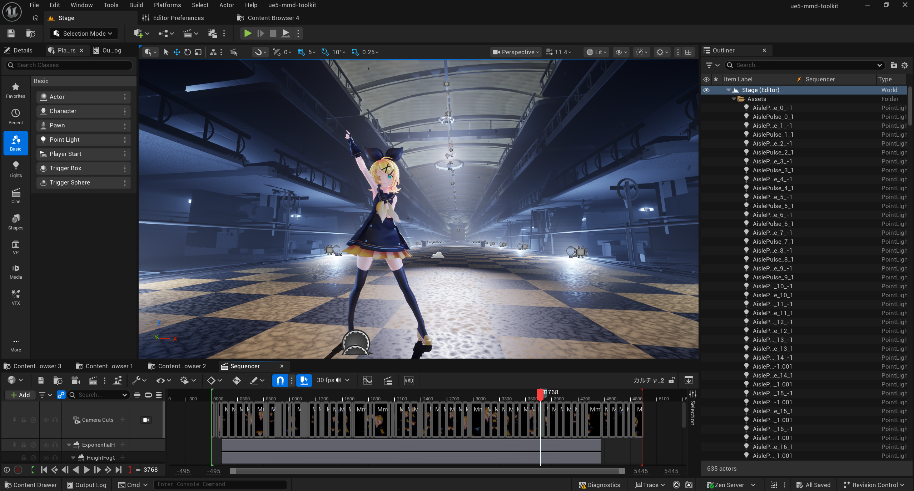

[](https://www.unrealengine.com/)
[](https://github.com/AMAP-N/ue5-mmd-toolkit/blob/main/LICENSE)
[](#)
[](https://github.com/AMAP-N/ue5-mmd-toolkit/releases)


## 概要
ue5-mmd-toolkit (AMAP5 V2) は、Unreal Engine 5でMMDフォーマットのPMX/VMDを扱うためのプラグインです。

PMXインポートではスケルタルメッシュ、スケルトン、アニメーションBP，マテリアルインスタンスなどの生成をします。
このプラグインは、Unreal Engineでより高度なワークフローにPMXを活用するための拡張ツールでもあります。
Unreal Engineは、MCP対応やMetaHuman Mocap，DCCツールからのアセット移行など、映像ではレンダラー、ゲームではグラフィックに強いリアルタイムエンジンとして注目されています。この両面に拡張可能な機能の確立を目指しています。


model: Sour暄 / [rendered demo](https://youtu.be/5gckcH_7DNo)

> [!WARNING]
> UEはレンダラーの側面が強いため、エクスポート機能の実装優先度は低いです。
> アセットの詳細編集はDCCツールの方が得意であるため、このプラグインだけで全ての工程が完結することを想定していません。
> セミリアル〜フォトリアルのマテリアル対応が中心です。(トゥーンやセルルックはUEでレンダリングするメリットが薄いため)


## 動作要件
### システム
- ランチャー版 Unreal Engine 5.8.x
- Windows11 64-bit

以下は利用できません。

- UE ≤ 5.7 / UE 5.9+
- GitHubからソースビルドしたエンジン、スタジオ独自ビルドなどランチャー版以外のエンジン

### プラグイン
- 必須(エンジン同梱・要有効化)
  - IK Rig
  - Control Rig
  - Compute Framework
  - Deformer Graph
- 任意
  - VRM4U(同梱プラグイン, VRM4Uマテリアルタイプを使う場合は必要)
  - MetaHuman / MetaHuman Animator(MetaHuman Mocapを使う場合は必要)


## 特徴
※一般的なPMX/VMDインポート手法：主に、DCCツール経由のFBX変換を指す。

| 項⁠目 | ue5-mmd-toolkit | 一般的手法との違い・補足 |
|---|---|---|
| 頂⁠点⁠変⁠形 | Deformer Graph(DG_SDEF)によるGPU SDEF/QDEFブレンドで保持・自動リペア | UE標準はSDEF非対応のため、FBX変換経由では通常SDEF情報が失われ、SDEF頂点のあるメッシュが破綻する |
| ボ⁠ー⁠ン⁠制⁠約 | 付与(親子)回転・移動、軸制限、IKチェーンを専用AnimGraphノード「PMX Bone Solver」でベイクせず解決 | 多くの手法はアニメーションをベイクした時点の見た目のみを再現し、後から差し替えたモーションには制約が追従しない |
| モ⁠ー⁠フ | 頂点V/ボーンB/材質M/グループGモーフをAnimGraphノード「PMX Morph」でモーフカーブとして評価(循環参照検出あり) | グループモーフの重み配分やボーンモーフの加算は個別実装が必要になりがち |
| リ⁠グ⁠生⁠成 | IKリグ/指・表情付属コントロールリグをワンステップで生成 | 通常はスケルトンのみが得られ、IKリグ/コントロールリグの構築は手動 |
| 物⁠理⁠演⁠算 | リジッドボディ/ジョイントをBullet Physicsで解釈し、アニメーションBPのRigidbodyノードへ直接書き込み(エディタ上で剛体をクリック選択してデバッグ可能) | 髪/スカートなどの揺れもの物理はPhysicsAssetなどの手動作成が必要になりがち |
| カ⁠メ⁠ラ | シーケンサーへカメラアクター/トラックとして取り込み、カメラカットタイプを指定可能 | カメラモーションを扱うインポータは少ない。noname0310様のMmdCameraImporterを移植/改良し、焦点ズレ等の問題を修正済み |
| モ⁠ー⁠キ⁠ャ⁠プ | MetaHuman Mocap実行の手順を簡素化し、結果をSMPLモデルで確認可能 | モーキャプ実行周辺の設定がかなり面倒 |

## 機能
### 実装済み
- PMXモデルインポート(SkeletalMesh生成、マテリアル自動構築: UE標準 / Toon(VRM4U連携)/ 白テクスチャ代替)
- PMXボーン制約の再現(付与回転・移動、軸制限、IKチェーン/リンク) — AnimGraphノード「PMX Bone Solver」
- 物理(剛体・ジョイント)インポート(Bullet Physics変換、AnimBlueprintのRigidBodyノードへの書き込み、エディタ上のデバッグ表示)
- PMXモーフの再現(頂点/ボーン/材質/グループモーフ) — AnimGraphノード「PMX Morph」
- BDEF/SDEF/QDEFインポートと頂点変形計算
- IKリグ生成(フルボディIK)
- コントロールリグ生成(FKコントロール・表情モーフのフェイスコントロールパネルなど)
- VMDモーションインポート(フレームレート選択可)
- VMDカメラインポート(Sequencerへのカメラアクター/トラック追加、カメラカットタイプ指定)
- MetaHuman Animatorマーカーレスモーションキャプチャ連携(動画ドロップ → ボディキャプチャ実行 → Performanceアセット出力)
- 外部UIブリッジ AMAP5.UI(Avalonia/.NET)

### タスク
- コントロールリグ (beta)
- IKリグ (beta)
- MetaHuman MocapのPMXリターゲット


## インストール 〜 使用方法
1. Unreal Engine 5.8(Win64)のプロジェクトを用意します。
2. 「プラグイン」ウィンドウで次が有効になっているか確認します：IK Rig / Control Rig / Compute Framework / Deformer Graph
3. (任意)VRM4Uのマテリアルタイプを使う場合は、同梱の `Plugins/VRM4U` をプロジェクトの `Plugins` フォルダに配置します。
4. (任意)MetaHuman Mocapを使う場合は、`MetaHuman Animator Markerless Motion Capture (Check)`から必要プラグインを有効化します。
5. `Plugins/ue5-mmd-toolkit` フォルダをプロジェクトの `Plugins` フォルダに配置します。
   最終的な配置が次の構成になることを想定しています。(任意配置込みの場合)
```text
YourProject/                       (プロジェクトルート)
├─ YourProject.uproject
└─ Plugins/
   ├─ ue5-mmd-toolkit/            (本プラグイン)
   │  └─ ue5-mmd-toolkit.uplugin  (Plugins下はそのまま配置)
   └─ VRM4U/                      (任意)
      └─ VRM4U.uplugin            (Plugins下はそのまま配置)
```
6. プロジェクトを起動します。
7. コンテンツブラウザにPMX/VMDをドロップインポートします。
8. 必要に応じて、「ue5-mmd-toolkit」メニューから追加でインポートします。
9. カメラVMDは、シーケンサーのVMDアイコンをクリックしてインポートします。


## 免責事項
本プラグインは、Epic Games, Unreal Engine, MikuMikuDanceその他関連する企業・団体とは一切関係ありません。
本プラグインの利用により生じたいかなる損害(プロジェクト・データの破損、インポートしたモデルやモーションに関する権利上の問題を含むがこれに限りません)についても、作者は一切の責任を負いません。

インポートするPMX / VMD / 動画データの著作権・利用規約の確認と遵守は、利用者ご自身の責任で行ってください。
本ソフトウェアは現状有姿(AS IS)で提供され、明示・黙示を問わずいかなる保証も行いません。


## ライセンス
MIT License

その他のライセンスについては、[THIRD_PARTY_NOTICES](LICENSES/THIRD_PARTY_NOTICES.md)をご確認ください。


## サポート・問い合わせ
質問や問題がある場合は、このリポジトリでIssueを立てるか、作者へ直接連絡してください。

AMAP-N [@Kapelz_](https://x.com/Kapelz_)
