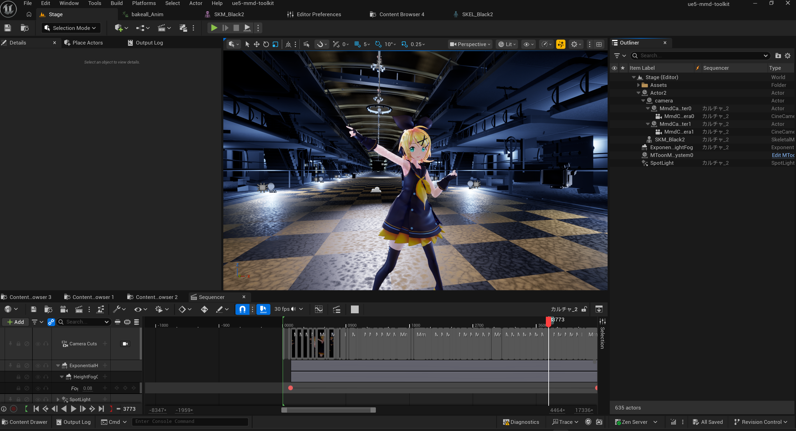

# ue5-mmd-toolkit

Unreal Engine 5でMMD向けデータを扱うための、Windows用プラグインです。



## 対応環境

- Unreal Engine 5.8
- Windows 11 / Win64

異なるUnreal Engineバージョンでは利用できません。

## 主な機能

- PMXモデルのインポート
- PMXのボーン、モーフ、表示枠、剛体、Jointデータの取り込み
- SDEF / QDEFを含むスキニング処理
- PMX IK、付与親、物理演算への対応
- VMDモーションおよびVMDカメラのインポート
- PMX向けの `UE Toon` / `UE Standard` マテリアル
- PMX用IK RigおよびPost Process Animation Blueprintの生成
- MetaHumanアニメーションからPMXモデルへのリターゲット支援
- VRM4Uマテリアルとの任意連携

## インストール

1. Unreal Editorを終了します。
2. このリポジトリの `Plugins/ue5-mmd-toolkit` フォルダを、使用するUnreal Engineプロジェクトの `Plugins` フォルダへコピーします。
3. 最終的な配置が次の構成になることを確認します。

```text
YourProject/
└─ Plugins/
   └─ ue5-mmd-toolkit/
      ├─ Binaries/
      ├─ Config/
      ├─ Content/
      ├─ Resources/
      ├─ Tools/
      └─ ue5-mmd-toolkit.uplugin
```

4. プロジェクトをUnreal Engine 5.8で開きます。
5. 必要に応じて「編集」>「プラグイン」から `ue5-mmd-toolkit` を有効にし、Editorを再起動します。

## 必須プラグイン

次のUnreal Engine標準プラグインを使用します。

- Compute Framework
- Deformer Graph

無効になっている場合は有効化し、Editorを再起動してください。

## 任意連携

- VRM4U
- MetaHuman

これらは必須ではありません。`UE Toon` と `UE Standard`、PMXインポート、SDEFなどの基本機能は、VRM4Uに依存しません。

## 基本的な使い方

PMXファイルをContent Browserへドラッグ＆ドロップし、表示されるインポート画面で設定を選択してインポートします。

マテリアルは次の用途を想定しています。

- `UE Toon`: MMDに近い見た目を目的とした、ue5-mmd-toolkit独自のマテリアル
- `UE Standard`: Unreal Engine標準のライティング環境へ移行しやすいマテリアル
- `(VRM4U)` 表記のマテリアル: VRM4Uが導入されている場合に使用する任意連携

---

## English

`ue5-mmd-toolkit` is a plugin for importing and using MikuMikuDance assets in Unreal Engine 5.8.

Copy `Plugins/ue5-mmd-toolkit` into your project's `Plugins` directory, enable the plugin, and restart Unreal Editor.
